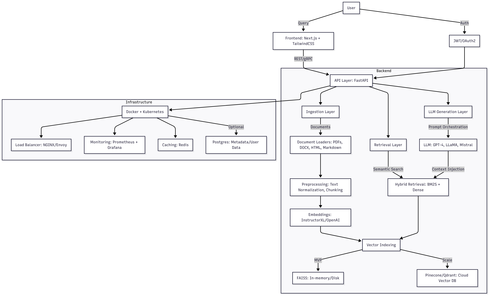

# KAIRO

KAIRO is a scalable knowledge engine built on top of Large Language Models (LLMs) with Retrieval-Augmented Generation (RAG). The goal is to enable enterprises and developers to query large-scale private or domain-specific data efficiently, with production-level scalability, modularity, and performance.

---

## Core Problem

LLMs are powerful but limited by their training cutoffs and lack of access to private or domain-specific data. Enterprises require systems that:

1. Incorporate proprietary knowledge.
2. Answer queries with factual grounding.
3. Scale to large datasets and high concurrency.
4. Offer an API-first architecture for integration.

KAIRO addresses this by combining LLMs with high-performance retrieval pipelines and an extensible backend architecture.

---

## System Overview

**Architecture (MVP → Scale):**

1. **Ingestion Layer**

   * Document loaders for PDFs, DOCX, HTML, Markdown, plain text.
   * Preprocessing: text normalization, chunking, sentence splitting.
   * Embeddings generated using transformer-based models (e.g., InstructorXL, OpenAI embeddings).

2. **Vector Indexing**

   * Phase 1 (MVP): FAISS (local, in-memory / persisted with disk serialization).
   * Phase 2: Cloud vector DB (Pinecone/Qdrant) for persistence and scalability.

3. **Retrieval Layer**

   * Semantic search with top-k retrieval.
   * Hybrid retrieval (BM25 + dense embeddings) for higher recall.

4. **LLM Generation Layer**

   * Prompt orchestration with context injection.
   * Configurable LLM backend: OpenAI GPT, LLaMA, Mistral, or fine-tuned domain-specific models.
   * Chain of Thought / ReAct prompting for reasoning tasks.

5. **API Layer**

   * Exposed via FastAPI (REST initially, later gRPC for high throughput).
   * Endpoints: `/ingest`, `/ask`, `/health`.
   * Rate-limiting and auth (JWT/OAuth2).

6. **Frontend (minimal)**

   * Next.js + TailwindCSS basic interface.
   * Single chat UI to query backend.
   * Deployed separately for modular scaling.

7. **Scaling Components**

   * Deployment via Docker + Kubernetes.
   * Load balancing with NGINX/Envoy.
   * Monitoring with Prometheus + Grafana.
   * Caching layer (Redis) for repeated queries.

---

## Technical Roadmap

**Phase 0 — Specification**

* Define core product scope.
* Create GitHub repo, README, architecture diagram.

**Phase 1 — MVP (4–6 weeks, solo dev)**

* Backend: FastAPI, FAISS, OpenAI embeddings, OpenAI GPT-4/3.5.
* Basic ingestion + retrieval + query pipeline.
* One REST endpoint (`/ask`).
* Minimal frontend with chat interface.
* Deploy backend (Render/Fly.io) and frontend (Vercel).

**Phase 2 — Scaling (2–3 months)**

* Swap FAISS → Pinecone/Qdrant (managed).
* Add user auth, sessions, and persistence.
* Introduce hybrid retrieval (BM25 + dense).
* Add monitoring and basic analytics.
* Optimize inference with quantized or fine-tuned models.

**Phase 3 — Production (3–6 months)**

* Kubernetes-based deployment.
* API versioning and multi-tenant support.
* Redis caching layer.
* Horizontal scaling to 10k+ concurrent users.
* Fine-tuned domain-specific models.
* Potential SaaS release with billing + admin dashboard.

---

## Tech Stack

* **Backend**: FastAPI, Python 3.11, LangChain for orchestration.
* **Vector Indexing**: FAISS (MVP), Pinecone/Qdrant (scale).
* **Embeddings**: OpenAI embeddings / InstructorXL.
* **LLM**: OpenAI GPT-4, LLaMA 2, or fine-tuned models.
* **Frontend**: Next.js, TailwindCSS, shadcn.
* **Infra**: Docker, Kubernetes, AWS/GCP/Azure.
* **Monitoring**: Prometheus, Grafana.
* **Database (optional)**: Postgres for metadata and user data.

---

## Deployment Strategy

* **MVP**: Monolithic deployment (FastAPI + FAISS in one container).
* **Scale**: Microservices:

  * Ingestion service.
  * Retrieval service.
  * LLM inference service.
  * API gateway.
* Horizontal scaling via Kubernetes.
* Autoscaling rules based on CPU/GPU utilization.

---

## Cost Estimate

* **MVP (FAISS + OpenAI API + cheap hosting)**: \$50–100/month.
* **Early scale (vector DB + monitoring + infra)**: \$200–350/month.
* **Production scale (multi-region, GPU-backed inference)**: \$2k–5k/month+.

---

## Differentiation

* Modular design (swap any component: embeddings, vector DB, LLM).
* Enterprise-ready architecture (auth, monitoring, scaling).
* Designed for both **recruiter shock value** and **commercial viability**.
* Competitive against existing RAG solutions due to focus on scalability + extensibility.

---

## Current Status

* Phase 0 (specification) → in progress.
* Repository bootstrapped with README and architecture plan.
* Backend prototyping next.

KAIRO is not a static demo but a long-term, production-heavy system designed to evolve into a full-fledged SaaS product.
